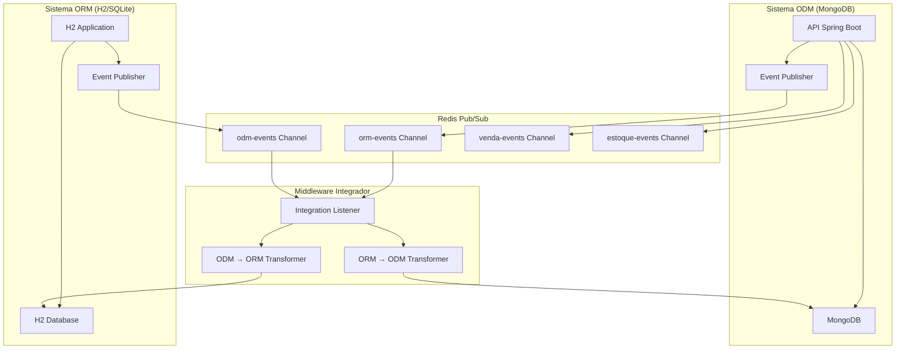

# API RESTful para Petshop - Spring Boot, MongoDB e Redis Pub/Sub

Esta é uma API RESTful desenvolvida com Spring Boot, MongoDB e Redis para gerenciamento de petshop com arquitetura de eventos e integração bidirecional.

## 🏗️ Arquitetura do Sistema

### **Arquitetura Pub/Sub com Redis**
O sistema utiliza uma arquitetura de eventos com Redis Pub/Sub para comunicação entre componentes:



### **Componentes da Arquitetura**

#### **1. Eventos de Integração**
- `IntegrationEvent`: Evento base para comunicação entre sistemas
- `VendaEvent`: Eventos específicos de vendas
- `EstoqueEvent`: Eventos de atualização de estoque
- Suporta operações: CREATE, UPDATE, DELETE

#### **2. Middleware Integrador**
- `IntegrationListener`: Escuta eventos dos canais Redis
- `OrmToOdmTransformer`: Converte dados relacional → documento
- `OdmToOrmTransformer`: Converte dados documento → relacional

#### **3. Canais de Eventos**
- `orm-events`: Eventos do sistema ORM (H2/SQLite)
- `odm-events`: Eventos do sistema ODM (MongoDB)
- `venda-events`: Eventos de vendas
- `estoque-events`: Eventos de estoque

## 🏪 Funcionalidades do Petshop

### **Gestão de Clientes**
- Cadastro completo de clientes com validações
- Busca por nome, email, CPF e telefone
- Controle de status ativo/inativo
- Relacionamento com pets
- **Sincronização bidirecional** entre sistemas

### **Gestão de Pets**
- Cadastro de pets vinculados aos clientes
- Informações completas (espécie, raça, peso, etc.)
- Busca por nome, raça e espécie
- Controle de status ativo/inativo

### **Gestão de Produtos**
- Cadastro de produtos com categorias
- Controle de estoque automático
- Busca por nome, categoria, marca
- Alertas de estoque baixo
- Gestão de preços
- **Eventos de estoque** em tempo real

### **Sistema de Agendamentos**
- Agendamento de serviços (banho, tosa, consulta)
- Controle de status (agendado, confirmado, realizado, cancelado)
- Verificação de conflitos de horário
- Relacionamento com clientes, pets e funcionários
- Filtros por período, status e serviço

### **Sistema de Vendas**
- Venda de produtos com múltiplos itens
- Cálculo automático de totais
- Controle de estoque na finalização
- Múltiplas formas de pagamento
- Relatórios de vendas por período
- **Eventos de venda** em tempo real

## 🛠️ Tecnologias Utilizadas

- **Spring Boot 3.2.0**
- **Spring Data MongoDB**
- **Spring Data Redis**
- **MongoDB**
- **Redis**
- **H2 Database** (sistema ORM)
- **Java 17**
- **Maven**
- **Bean Validation**
- **Spring Boot Actuator**

## 📁 Estrutura do Projeto

```
src/main/java/com/grupo7/api/
├── ApiApplication.java              # Classe principal
├── config/
│   ├── MongoConfig.java            # Configuração MongoDB
│   ├── RedisConfig.java            # Configuração Redis
│   └── IntegrationConfig.java      # Configuração integração
├── controller/
│   ├── ClienteController.java      # Gestão de clientes
│   ├── PetController.java          # Gestão de pets
│   ├── ProdutoController.java      # Gestão de produtos
│   ├── AgendamentoController.java  # Gestão de agendamentos
│   ├── VendaController.java        # Gestão de vendas
│   ├── UsuarioController.java      # Gestão de usuários
│   ├── HealthController.java       # Saúde da API
│   ├── EventController.java        # Teste de eventos
│   └── IntegrationController.java  # Teste de integração
├── event/
│   ├── BaseEvent.java              # Evento base
│   ├── VendaEvent.java             # Evento de venda
│   ├── EstoqueEvent.java           # Evento de estoque
│   └── IntegrationEvent.java       # Evento de integração
├── exception/
│   └── GlobalExceptionHandler.java # Tratamento de erros
├── integration/
│   ├── IntegrationListener.java    # Listener de integração
│   └── transformer/
│       ├── OrmToOdmTransformer.java # Transformador ORM→ODM
│       └── OdmToOrmTransformer.java # Transformador ODM→ORM
├── listener/
│   └── EventListeners.java         # Listeners de eventos
├── model/
│   ├── BaseEntity.java             # Classe base
│   ├── Cliente.java               # Entidade Cliente
│   ├── Pet.java                   # Entidade Pet
│   ├── Produto.java               # Entidade Produto
│   ├── Agendamento.java           # Entidade Agendamento
│   ├── Venda.java                 # Entidade Venda
│   └── Usuario.java               # Entidade Usuario
├── repository/
│   ├── ClienteRepository.java     # Repositório Cliente
│   ├── PetRepository.java         # Repositório Pet
│   ├── ProdutoRepository.java     # Repositório Produto
│   ├── AgendamentoRepository.java # Repositório Agendamento
│   ├── VendaRepository.java       # Repositório Venda
│   └── UsuarioRepository.java     # Repositório Usuario
└── service/
    ├── ClienteService.java        # Serviço Cliente
    ├── PetService.java            # Serviço Pet
    ├── ProdutoService.java        # Serviço Produto
    ├── AgendamentoService.java    # Serviço Agendamento
    ├── VendaService.java          # Serviço Venda
    ├── UsuarioService.java        # Serviço Usuario
    └── EventPublisherService.java # Publicador de eventos
```

## 🚀 Configuração

### Pré-requisitos
- Java 17 ou superior
- Maven 3.6+
- MongoDB 4.4+
- Redis 6.0+
- Docker (opcional)

### Executando com Docker

#### **1. Iniciar Infraestrutura**
```bash
# Iniciar Redis
cd redis
docker-compose up -d

# Iniciar MongoDB
cd mongodb
docker-compose up -d
```

#### **2. Executar Aplicações**
```bash
# API Principal (MongoDB)
cd api
mvn spring-boot:run

# Aplicação H2 (ORM)
cd sqlite
mvn spring-boot:run
```

### Executando Localmente

#### **1. Instalar Redis**
```bash
# Windows (WSL)
sudo apt-get install redis-server

# macOS
brew install redis

# Linux
sudo apt-get install redis-server
```

#### **2. Executar Aplicações**
```bash
# API Principal
cd api
mvn spring-boot:run

# Aplicação H2
cd sqlite
mvn spring-boot:run
```

## 📋 Endpoints Principais

### **Clientes** (`/api/clientes`)
- `GET /` - Listar todos os clientes
- `GET /{id}` - Buscar cliente por ID
- `GET /email/{email}` - Buscar por email
- `GET /cpf/{cpf}` - Buscar por CPF
- `GET /ativos` - Listar clientes ativos
- `GET /busca/geral?termo={termo}` - Busca geral
- `POST /` - Criar cliente
- `PUT /{id}` - Atualizar cliente
- `DELETE /{id}` - Deletar cliente
- `PATCH /{id}/status?ativo={boolean}` - Alterar status

### **Pets** (`/api/pets`)
- `GET /` - Listar todos os pets
- `GET /{id}` - Buscar pet por ID
- `GET /cliente/{clienteId}` - Pets de um cliente
- `GET /especie/{especie}` - Pets por espécie
- `GET /raca/{raca}` - Pets por raça
- `GET /ativos` - Listar pets ativos
- `GET /busca/geral?termo={termo}` - Busca geral
- `POST /` - Criar pet
- `PUT /{id}` - Atualizar pet
- `DELETE /{id}` - Deletar pet
- `PATCH /{id}/peso?peso={peso}` - Atualizar peso

### **Produtos** (`/api/produtos`)
- `GET /` - Listar todos os produtos
- `GET /{id}` - Buscar produto por ID
- `GET /codigo/{codigo}` - Buscar por código
- `GET /ativos` - Listar produtos ativos
- `GET /categoria/{categoria}` - Produtos por categoria
- `GET /estoque-baixo?limite={limite}` - Produtos com estoque baixo
- `GET /preco?precoMin={min}&precoMax={max}` - Produtos por faixa de preço
- `GET /busca/geral?termo={termo}` - Busca geral
- `POST /` - Criar produto
- `PUT /{id}` - Atualizar produto
- `DELETE /{id}` - Deletar produto
- `PATCH /{id}/estoque?quantidade={qtd}` - Atualizar estoque
- `PATCH /{id}/preco?preco={preco}` - Atualizar preço

### **Agendamentos** (`/api/agendamentos`)
- `GET /` - Listar todos os agendamentos
- `GET /{id}` - Buscar agendamento por ID
- `GET /cliente/{clienteId}` - Agendamentos de um cliente
- `GET /pet/{petId}` - Agendamentos de um pet
- `GET /hoje` - Agendamentos de hoje
- `GET /semana` - Agendamentos da semana
- `GET /pendentes` - Agendamentos pendentes
- `GET /confirmados` - Agendamentos confirmados
- `GET /realizados` - Agendamentos realizados
- `GET /cancelados` - Agendamentos cancelados
- `GET /servico/{servico}` - Agendamentos por serviço
- `POST /` - Criar agendamento
- `PUT /{id}` - Atualizar agendamento
- `DELETE /{id}` - Deletar agendamento
- `PATCH /{id}/confirmar` - Confirmar agendamento
- `PATCH /{id}/realizar` - Realizar agendamento
- `PATCH /{id}/cancelar` - Cancelar agendamento

### **Vendas** (`/api/vendas`)
- `GET /` - Listar todas as vendas
- `GET /{id}` - Buscar venda por ID
- `GET /cliente/{clienteId}` - Vendas de um cliente
- `GET /hoje` - Vendas de hoje
- `GET /semana` - Vendas da semana
- `GET /mes` - Vendas do mês
- `GET /pendentes` - Vendas pendentes
- `GET /pagas` - Vendas pagas
- `GET /total/hoje` - Total de vendas hoje
- `GET /total/semana` - Total de vendas da semana
- `GET /total/mes` - Total de vendas do mês
- `POST /` - Criar venda
- `PUT /{id}` - Atualizar venda
- `DELETE /{id}` - Deletar venda
- `PATCH /{id}/finalizar?formaPagamento={forma}` - Finalizar venda
- `PATCH /{id}/cancelar` - Cancelar venda

### **Eventos** (`/api/events`)
- `POST /test/venda` - Testar evento de venda
- `POST /test/estoque` - Testar evento de estoque
- `GET /status` - Status do sistema de eventos

### **Integração** (`/api/integration`)
- `POST /orm-to-odm` - Testar integração ORM → ODM
- `POST /odm-to-orm` - Testar integração ODM → ORM
- `POST /test/cliente` - Teste de cliente ORM → ODM
- `POST /test/produto` - Teste de produto ODM → ORM
- `GET /status` - Status da integração

### **Aplicação H2** (`/sqlite/clientes`)
- `GET /` - Listar todos os clientes
- `GET /{id}` - Buscar cliente por ID
- `GET /email/{email}` - Buscar por email
- `GET /cpf/{cpf}` - Buscar por CPF
- `GET /ativo/{ativo}` - Listar por status
- `GET /buscar/{termo}` - Busca geral
- `POST /` - Criar cliente
- `PUT /{id}` - Atualizar cliente
- `DELETE /{id}` - Deletar cliente
- `GET /status` - Status da aplicação

## 💡 Exemplos de Uso

### **Teste de Sincronização Bidirecional**

#### **1. Criar Cliente no H2 (ORM → ODM)**
```bash
curl -X POST http://localhost:8083/sqlite/clientes \
  -H "Content-Type: application/json" \
  -d '{
    "nome": "João Silva",
    "email": "joao@email.com",
    "telefone": "(11) 99999-9999",
    "endereco": "Rua das Flores, 123",
    "cpf": "123.456.789-00",
    "ativo": 1
  }'
```

#### **2. Verificar Sincronização no MongoDB**
```bash
curl http://localhost:8080/api/clientes/email/joao@email.com
```

#### **3. Criar Cliente no MongoDB (ODM → ORM)**
```bash
curl -X POST http://localhost:8080/api/clientes \
  -H "Content-Type: application/json" \
  -d '{
    "nome": "Maria Santos",
    "email": "maria@email.com",
    "telefone": "(11) 88888-8888",
    "endereco": "Av. Paulista, 1000",
    "cpf": "987.654.321-00",
    "ativo": true
  }'
```

#### **4. Verificar Sincronização no H2**
```bash
curl http://localhost:8083/sqlite/clientes/email/maria@email.com
```

### **Teste de Eventos**

#### **Teste de Evento de Venda**
```bash
curl -X POST http://localhost:8080/api/events/test/venda \
  -H "Content-Type: application/json" \
  -d '{
    "action": "CRIADA",
    "vendaId": "venda-123"
  }'
```

#### **Teste de Evento de Estoque**
```bash
curl -X POST http://localhost:8080/api/events/test/estoque \
  -H "Content-Type: application/json" \
  -d '{
    "produtoId": "produto-456",
    "produtoNome": "Ração Premium",
    "quantidadeAnterior": 100,
    "quantidadeAtual": 95,
    "motivo": "VENDA"
  }'
```

## 🔧 Funcionalidades Especiais

### **Controle de Estoque**
- Atualização automática do estoque na finalização de vendas
- Alertas de produtos com estoque baixo
- Validação de disponibilidade antes da venda
- **Eventos de estoque** em tempo real

### **Gestão de Agendamentos**
- Verificação de conflitos de horário
- Controle de status (agendado → confirmado → realizado)
- Filtros por período e serviço

### **Relatórios de Vendas**
- Total de vendas por período (hoje, semana, mês)
- Vendas por cliente
- Vendas por forma de pagamento

### **Sincronização Bidirecional**
- **ORM → ODM**: Dados do H2 sincronizados com MongoDB
- **ODM → ORM**: Dados do MongoDB sincronizados com H2
- Transformação automática de tipos de dados
- Tratamento de conflitos de dados

### **Sistema de Eventos**
- **Pub/Sub** com Redis
- Eventos de venda em tempo real
- Eventos de estoque em tempo real
- Integração bidirecional automática

### **Validações**
- Validação de CPF e email únicos
- Validação de códigos de produto únicos
- Validação de datas futuras para agendamentos
- Validação de estoque suficiente
