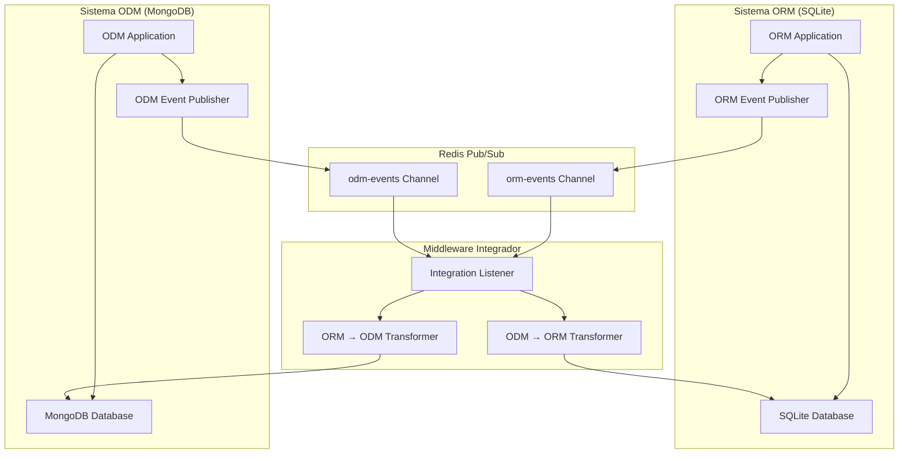
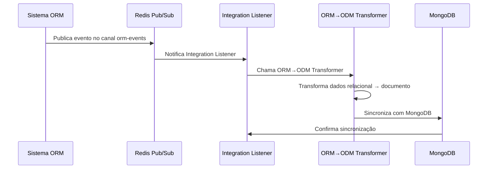
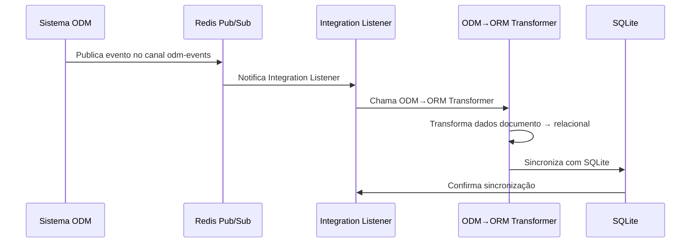

# Arquitetura de Integração Bidirecional ORM ↔ ODM

## Visão Geral

Esta implementação cria um sistema de integração bidirecional entre dois sistemas heterogêneos usando Redis Pub/Sub como middleware de comunicação:

- **Sistema 1**: ORM com SQLite (Relacional)
- **Sistema 2**: ODM com MongoDB (NoSQL)

## Arquitetura do Sistema



## Componentes da Arquitetura

### 1. **Eventos de Integração**
- `IntegrationEvent`: Evento base para comunicação entre sistemas
- Suporta operações: CREATE, UPDATE, DELETE
- Inclui metadados: sourceSystem, targetSystem, entityType, entityId

### 2. **Middleware Integrador**
- `IntegrationListener`: Escuta eventos dos canais Redis
- `OrmToOdmTransformer`: Converte dados relacional → documento
- `OdmToOrmTransformer`: Converte dados documento → relacional

### 3. **Transformadores de Dados**
- Conversão de tipos de dados entre sistemas
- Mapeamento de campos (camelCase ↔ snake_case)
- Tratamento de tipos específicos (Boolean ↔ Integer)

## Fluxo de Integração

### ORM → ODM (SQLite → MongoDB)



### ODM → ORM (MongoDB → SQLite)



## Transformações de Dados

### Exemplo: Cliente

#### ORM → ODM
```json
// Dados ORM (SQLite)
{
  "id": "cliente-123",
  "nome": "João Silva",
  "email": "joao@email.com",
  "telefone": "(11) 99999-9999",
  "endereco": "Rua das Flores, 123",
  "cpf": "123.456.789-00",
  "ativo": 1  // Integer
}

// Transformação para ODM (MongoDB)
{
  "id": "cliente-123",
  "nome": "João Silva",
  "email": "joao@email.com",
  "telefone": "(11) 99999-9999",
  "endereco": "Rua das Flores, 123",
  "cpf": "123.456.789-00",
  "ativo": true  // Boolean
}
```

#### ODM → ORM
```json
// Dados ODM (MongoDB)
{
  "id": "cliente-123",
  "nome": "João Silva",
  "email": "joao@email.com",
  "telefone": "(11) 99999-9999",
  "endereco": "Rua das Flores, 123",
  "cpf": "123.456.789-00",
  "ativo": true  // Boolean
}

// Transformação para ORM (SQLite)
{
  "id": "cliente-123",
  "nome": "João Silva",
  "email": "joao@email.com",
  "telefone": "(11) 99999-9999",
  "endereco": "Rua das Flores, 123",
  "cpf": "123.456.789-00",
  "ativo": 1  // Integer
}
```

## Como Usar

### 1. Iniciar Infraestrutura
```bash
# Iniciar Redis
cd redis
docker-compose up -d

# Iniciar MongoDB (se não estiver rodando)
cd mongodb
docker-compose up -d
```

### 2. Testar Integração

#### Teste ORM → ODM
```bash
curl -X POST http://localhost:8080/api/integration/test/cliente
```

#### Teste ODM → ORM
```bash
curl -X POST http://localhost:8080/api/integration/test/produto
```

#### Teste Customizado
```bash
# ORM → ODM
curl -X POST http://localhost:8080/api/integration/orm-to-odm \
  -H "Content-Type: application/json" \
  -d '{
    "entityType": "CLIENTE",
    "entityId": "cliente-789",
    "operation": "CREATE",
    "data": {
      "id": "cliente-789",
      "nome": "Maria Santos",
      "email": "maria@email.com",
      "telefone": "(11) 88888-8888",
      "endereco": "Av. Paulista, 1000",
      "cpf": "987.654.321-00",
      "ativo": 1
    }
  }'

# ODM → ORM
curl -X POST http://localhost:8080/api/integration/odm-to-orm \
  -H "Content-Type: application/json" \
  -d '{
    "entityType": "PRODUTO",
    "entityId": "produto-789",
    "operation": "UPDATE",
    "data": {
      "id": "produto-789",
      "nome": "Brinquedo Interativo",
      "descricao": "Brinquedo para gatos",
      "categoria": "Brinquedos",
      "codigo": "BRINQ001",
      "marca": "PetToys",
      "tamanho": "M",
      "preco": 29.90,
      "estoque": 50,
      "peso": 0.5,
      "ativo": true
    }
  }'
```

### 3. Monitorar Status
```bash
curl http://localhost:8080/api/integration/status
```

## Entidades Suportadas

| Entidade | ORM → ODM | ODM → ORM | Operações |
|----------|-----------|-----------|-----------|
| CLIENTE | ✅ | ✅ | CREATE, UPDATE, DELETE |
| PRODUTO | ✅ | ✅ | CREATE, UPDATE, DELETE |
| VENDA | ✅ | ✅ | CREATE, UPDATE, DELETE |
| PET | 🔄 | 🔄 | CREATE, UPDATE, DELETE |
| AGENDAMENTO | 🔄 | 🔄 | CREATE, UPDATE, DELETE |

## Configuração

### Redis
```yaml
spring:
  data:
    redis:
      host: localhost
      port: 6379
      database: 0
      timeout: 2000ms
```

### Canais de Eventos
- `orm-events`: Eventos do sistema ORM
- `odm-events`: Eventos do sistema ODM

## Benefícios da Arquitetura

### 1. **Desacoplamento Total**
- Sistemas não precisam conhecer um ao outro
- Mudanças em um sistema não afetam o outro
- Desenvolvimento independente

### 2. **Escalabilidade**
- Cada sistema pode escalar independentemente
- Redis suporta alta concorrência
- Fácil adição de novos sistemas

### 3. **Resiliência**
- Falhas em um sistema não afetam o outro
- Redis garante entrega de mensagens
- Processamento assíncrono

### 4. **Flexibilidade**
- Suporte a diferentes tipos de dados
- Transformações customizáveis
- Fácil extensão para novas entidades

## Monitoramento e Logs

### Logs de Integração
```
2024-01-15 10:30:00 - Evento de integração recebido: IntegrationEvent{sourceSystem='ORM', entityType='CLIENTE', operation='CREATE', entityId='cliente-123'} - Canal: orm-events
2024-01-15 10:30:00 - Processando evento ORM → ODM: IntegrationEvent{sourceSystem='ORM', entityType='CLIENTE', operation='CREATE', entityId='cliente-123'}
2024-01-15 10:30:00 - Transformando dados ORM → ODM para entidade: CLIENTE
2024-01-15 10:30:00 - Sincronizando CLIENTE com ID cliente-123 para ODM
2024-01-15 10:30:00 - Sincronização ORM → ODM concluída para entidade: cliente-123
```

### Métricas Recomendadas
- Eventos processados por segundo
- Tempo de transformação
- Taxa de erro por direção
- Latência de sincronização

## Próximos Passos

### 1. **Implementar Persistência de Eventos**
- Event Sourcing para auditoria
- Dead Letter Queue para eventos com falha
- Replay de eventos

### 2. **Melhorar Transformações**
- Mapeamentos customizáveis
- Validação de dados
- Transformações condicionais

### 3. **Adicionar Segurança**
- Autenticação entre sistemas
- Criptografia de dados sensíveis
- Validação de origem dos eventos

### 4. **Implementar Sincronização Bidirecional Completa**
- Detecção de conflitos
- Resolução de conflitos
- Sincronização incremental

### 5. **Dashboard de Monitoramento**
- Interface web para monitoramento
- Alertas em tempo real
- Métricas de performance

## Troubleshooting

### Problemas Comuns

1. **Eventos não são processados**
   - Verificar conectividade com Redis
   - Verificar se listeners estão registrados
   - Verificar logs de erro

2. **Transformações falham**
   - Verificar tipos de dados
   - Verificar mapeamentos de campos
   - Verificar validações

3. **Sincronização não funciona**
   - Verificar conectividade com bancos
   - Verificar permissões de escrita
   - Verificar estrutura das tabelas/coleções

### Comandos Úteis

```bash
# Verificar Redis
redis-cli ping

# Monitorar eventos
redis-cli monitor

# Verificar canais ativos
redis-cli pubsub channels "*"

# Limpar Redis
redis-cli flushall
``` 